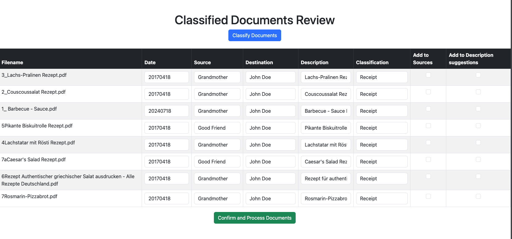

# AI document classifier
 The purpose of this project is to create a document classifier for all kind of documents that I receive. It uses the OpenAI API to classify the documents. It provides also a simple UI to adapt the different properties that it detected on the document.



## Usage

### Configuration

Create a config.json file with the following content in the input folder for your documents.
    
```json
{
    "api_key": "Your OpenAI API key",
    "sources": ["Grandma", "Good Friend", "Family"],
    "destinations": ["John Doe", "Jane Doe", "Myself"],
    "classifications": ["Personal", "Receipt", "Work", "Finance", "Health", "Legal", "Other"]
  }
```

If you add sources and description suggestions via the GUI, an additional file will be created in the input folder called additional_data.json. This file will be used to suggest sources and descriptions in the future.

### Standalone

You need to have docker or docker desktop installed on your computer.

Copy the run.sh file to your computer then modify the input and output directories to the desired locations. You can also modify the port number for the UI (default is 5123).

### Docker

Feel free to run the docker container on a server. This will keept the UI available and you can simply copy new documents to the input folder and the click on the "Classify" button.