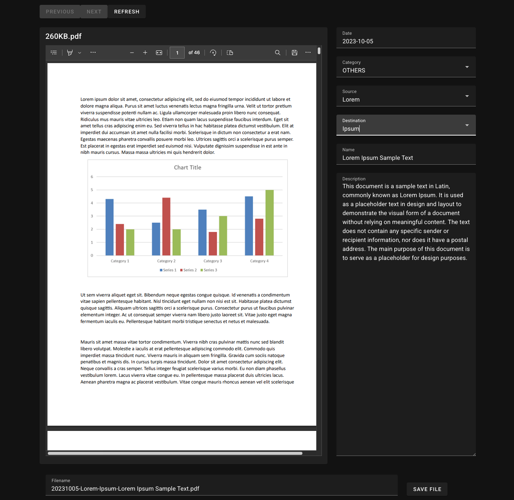

# AI document classifier
 The purpose of this project is to create a document classifier for all kind of documents that I receive. It uses the Mistral API to classify the documents. It provides also a simple UI to adapt the different properties that it detected on the document.



## Installation

Currently the docker image is not available in a public repository. You can build the image by running the following command:

```bash
docker build -t ai-document-classifier .
```

## Running the application

To run the application, you can use the following command:

```bash
docker run -p 5298:5298 \
  -e SMB_USERNAME=dms \
  -e SMB_PASSWORD=SmbPassword123 \
  -e SMB_SERVER=//mysmbserver/dms \
  -e SMB_MOUNTPOINT=/mnt/dms_scans \
  -e DATA_PATH=/data \
  -e ADOBE_CLIENT_ID=AdobeApiClientId \
  -e ADOBE_CLIENT_SECRET=AdobeApiClientSecret \
  -e MISTRAL_API_KEY=MistralApiKey \
  -v /path/to/data:/data \
  ai-document-classifier
```

## Usage

### Configuration

Create a config.json file with the following content in the data folder.
    
```json
{
  "categories": [
    "INVOICES_AND_WARRANTIES",
    "HEALTHCARE",
    "PETS",
    "HOME_RELATED",
    "CARS_RELATED",
    "WORK_RELATED",
    "BANKING",
    "TAX",
    "LICENCES",
    "OTHERS"
  ],
  "sources": [
    "Office for National GitHub Projects"
  ],
  "destinations": [
    "John Doe"
  ]
}
```

### Environment Variables Documentation

#### SMB_USERNAME
- **Description**: Username for SMB (Server Message Block) authentication.
- **Example**: `dms`

#### SMB_PASSWORD
- **Description**: Password for SMB authentication.
- **Example**: `SmbPassword123`

#### SMB_SERVER
- **Description**: URL of the SMB server.
- **Example**: `//mysmbserver/dms`

#### SMB_MOUNTPOINT
- **Description**: Local mount point for the SMB share.
- **Example**: `/mnt/dms_scans`

#### DATA_PATH
- **Description**: Path to the data directory.
- **Example**: `/data`

#### ADOBE_CLIENT_ID
- **Description**: Client ID for Adobe API authentication.
- **Example**: `AdobeApiClientId`

#### ADOBE_CLIENT_SECRET
- **Description**: Client Secret for Adobe API authentication.
- **Example**: `AdobeApiClientSecret`

#### MISTRAL_API_KEY
- **Description**: API key for Mistral service.
- **Example**: `MistralApiKey`

